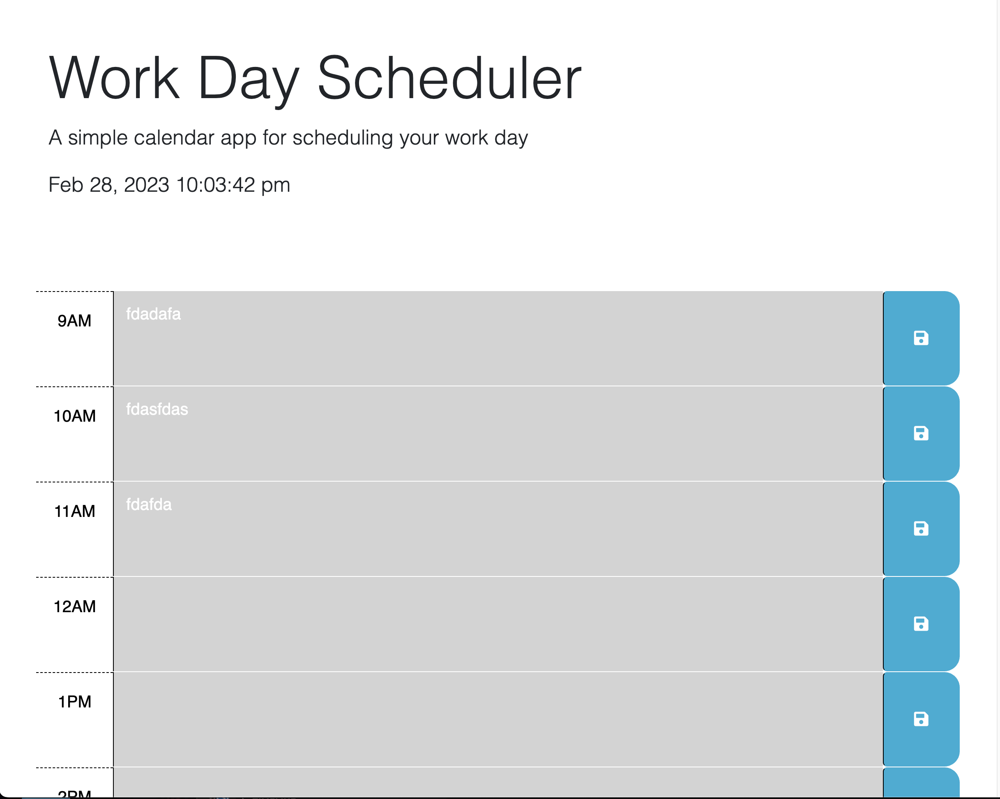

# Work-Day-Scheduler
- To start with, I created the calendar function by putting a dayjs() file in
a setinterval function.
- Of course, that didn't immediately work with the timer not ticking, but after toying with it for some time I found out that the variable wasn't being declared in the function.
- After that I set my sights on having the colors change with the time of day, which was a herculean effort of if statements and having no results.
- Ditching that for the time being, I began working on the saving function, which didn't go too well either, as I was making it needlessly over complicated.
- After some trimming, I got the save function to save the text area to my local storage and then place it when the page was reloaded.
- I got some help with my calendar colors, and after setting up a function to read the id of the divs, I got the function to finally switch colors correctly.

Website Link: https://alphastranger.github.io/Work-Day-Scheduler/

